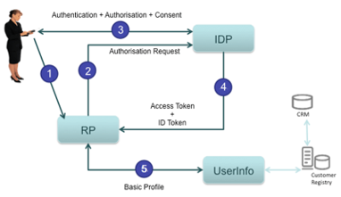

# Service Architecture

## Keycloak

TERRA AAI is backed by Keycloak Identity and access management solution.

Keycloak is an open-source Identity and Access Management (IAM) solution that centralizes authentication, authorization, and user management for modern applications and services. Its primary purpose is to remove security concerns from individual applications by acting as a dedicated Identity Provider. Keycloak provides:

* Support for industry-standard protocols such as OAuth 2.0, OpenID Connect, and SAML 2.0
* Single Sign-On (SSO) across multiple applications and services
* Integration with external identity providers, including enterprise directories and social logins
* Built-in support for multi-factor authentication and fine-grained access control

Keycloak is built on proven Java technologies and is designed to operate efficiently in cloud-native and microservice-based environments.

Keycloak is designed for scalability, high availability, and portability, making it suitable for cloud deployments:

* Horizontal scaling through multiple Keycloak instances running behind a load balancer
* High availability support, with shared state managed via a relational database and distributed caching
* Official Docker container images, enabling consistent and portable deployments across environments

For persistence, Keycloak supports relational database backends, including:
* PostgreSQL for storing realms, users, credentials, sessions, and configuration data
* Transactional and reliable storage suitable for heavy workloads

Keycloak also provides advanced features for governance and automation:
* User consent management, allowing users to explicitly approve which applications can access their profile data and scopes
* Centralized enforcement of privacy and compliance requirements
* A comprehensive administrative API, exposed via REST and a web-based admin console, supporting:
  * User, role, and group management
  * Client and realm configuration
  * Identity provider and protocol setup

## Single Sign On

The TERRA AAI service provices a Single Sign On (SSO) solution, offering significant benefits in the platform's microservices architecture by centralizing authentication and identity management across all services. Instead of each service implementing its own authentication logic, SSO allows users to authenticate once with a trusted identity provider and then securely access multiple services using standardized tokens (such as OAuth2 or OpenID Connect). This improves security by reducing duplicated credential handling, enabling consistent enforcement of authentication policies, and making it easier to apply features like multi-factor authentication, token expiration, and revocation in one place. From an architectural perspective, SSO simplifies microservice design by decoupling identity concerns from business logic, reducing development and maintenance effort, and promoting interoperability between services. It also enhances the user experience by eliminating repeated logins when navigating across services, while supporting scalability and resilience as new microservices can be added without re-implementing authentication.

Image from: https://www.questionmark.com/single-sign-on-pros-and-cons/

## OpenID Connect grant flows

Within TERRA, OpenID Connect is primarily used. OpenID Connect (OIDC) is an identity layer built on top of OAuth 2.0 that enables applications to verify an end user’s identity in a standardized way. In a typical example, the end user wants to sign in to a web application, known as the Relying Party (RP). Instead of handling credentials itself, the RP redirects the user to an Identity Provider (IdP), such as Keycloak or another OIDC-compliant service. The user authenticates with the IdP (through local username / password or through identity federation). Once authentication is successful, the IdP redirects the user back to the RP with an ID token, which contains verified claims about the user (such as their identity and authentication time), and optionally an access token. The RP validates the ID token’s signature and claims to confirm the user’s identity, then creates a local session for the user. This flow allows the RP to trust the IdP for authentication, giving the end user a seamless login experience while keeping credentials securely managed by the IdP.

Image from: https://developer.orange.com/tech_guide/openid-connect-1-0/

OpenID Connect supports multiple grant flows (also called authentication flows) to accommodate different types of clients, security requirements, and usage scenarios. These flows define how an application obtains tokens from the Identity Provider and how the end user is authenticated. Common OIDC flows include 
* the Authorization Code flow, which is recommended for server-side and browser-based applications due to its strong security properties
* the Authorization Code flow with PKCE, designed to protect public clients such as single-page and mobile applications
* the Client Credentials flow, used for machine-to-machine communication without an end user
* the Resource Owner Password Credentials flow, which allows direct credential exchange but is generally discouraged in favor of more secure alternatives

By supporting multiple grant flows, OIDC provides flexibility while allowing architects to choose the most secure and appropriate flow for each application type.

### Code Flow

The Authorization Code Flow and it PKCE variant are used in TERRA to authenticate end users through the end user accessible web application.

Image from: https://auth0.com/docs/flows/authorization-code-flow

### Client Credential Flow

The Client Credential Flow is used by individual services to authenticate their calls to other components, without requiring an end user to initialize the request and act on their behalf.

Image from: https://auth0.com/docs/flows/client-credentials-flow

### Token Exchange

Token exchange in OpenID Connect (OIDC) is a mechanism that allows one security token to be exchanged for another, typically with a different audience, scope, or level of privilege, without requiring the end user to re-authenticate. In practice, this is used in TERRA where an intermediary service receives a token issued by the TERRA AAI and then exchanges it for a new token that is trusted by a downstream service. For example, the API gateway may accept an access token from the user-facing web application and then perform a token exchange to obtain a new access token to invoke a specific backend service. This approach improves security by limiting token scope and audience, supports delegation and impersonation use cases, and helps maintain a clear trust boundary between services while preserving the user’s identity and authorization context.

Image from: https://www.scottbrady91.com/OAuth/Delegation-Patterns-for-OAuth-20

## JWT

TERRA utilized JWT token to authorize requests. JSON Web Token (JWT) is an open standard defined in RFC 7519 that specifies a compact, self-contained way to securely transmit information between parties as a JSON object. JWTs are widely used for authorization, particularly in modern web and microservice architectures. After a user successfully authenticates, a JWT is issued and included with each subsequent request, allowing the user to access only the routes, services, and resources permitted by the token’s claims. Because JWTs are lightweight and can be easily shared across different domains, they are a common choice for implementing Single Sign-On (SSO). JWTs are also used for secure information exchange, as they can be digitally signed, enabling recipients to verify both the identity of the sender and the integrity of the transmitted data.

A JWT consists of three Base64-encoded parts separated by dots (xxxxx.yyyyy.zzzzz). The header describes the token type (JWT) and the signing algorithm used, such as HMAC-SHA256 or RSA. The payload contains claims—statements about an entity (typically the user) and any additional metadata. The signature is created by signing the encoded header and payload together, for example using HMACSHA256(base64UrlEncode(header) + "." + base64UrlEncode(payload), secret), ensuring that the token cannot be altered without detection. 

Because JWTs function as credentials, their contents are exposed to anyone who possesses the token and cannot be changed once issued, no sensitive or secret information should be included in the payload. JWTs are typically sent using the HTTP Authorization header with the Bearer scheme (e.g., Authorization: Bearer <token>), and because they are transmitted in headers rather than cookies, they are not affected by Cross-Origin Resource Sharing (CORS) restrictions in the same way as cookie-based authentication.
